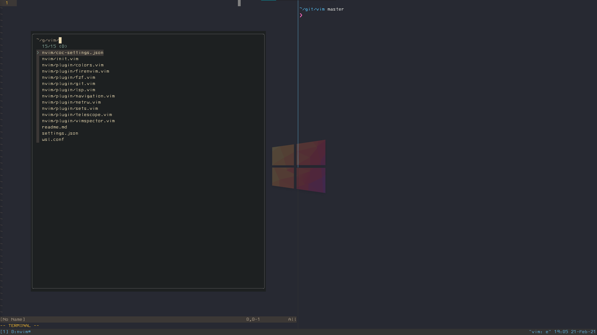

> Terminal / Vim Setup

 

This term terminal always refers to wsl Ubuntu 20.04.
During setup if not using username `cup` there will edits in files to make.

1. Install Powerline (powerhell script)
    - `git clone https://github.com/powerline/fonts.git --depth=1`
    - `cd fonts && ./install.ps1`
    - `cd .. && rm -rf fonts`
1. `mkdir ~/git && cd ~/git`
1. `git clone https://github.com/raymonddavis/vim`
1. `cp -rf ~/git/vim/wsl.conf /etc/wsl.conf`
1. Close terminal. open cmd and run `wsl.exe --shutdown`. Relaunch terminal.
1. Merge wsl settings.json (`<C-,>`) with settings.json in repo. (Settings assume windows is in dark mode)
1. Install nvm
    - `curl -o- https://raw.githubusercontent.com/nvm-sh/nvm/v0.37.2/install.sh | bash`
1. Install zsh
    - `sudo apt install zsh`
    - `chsh -s $(which zsh)`
1. Install Oh My Zsh
    - `sh -c "$(curl -fsSL https://raw.githubusercontent.com/ohmyzsh/ohmyzsh/master/tools/install.sh)"`
1. Install zsh-syntax-highlighting
    - `git clone https://github.com/zsh-users/zsh-syntax-highlighting.git ${ZSH_CUSTOM:-~/.oh-my-zsh/custom}/plugins/zsh-syntax-highlighting`
1. Copy .zshrc

    - `cp -rf ~/git/vim/.zshrc ~/.zshrc`
    - (Optional) Change username if not cup
        - `vim ~/.zshrc`
        - `:%s/cup/_USERNAME_HERE_/g`
        - `:wq`
    - Remove ssh key from keychain
        - `vim ~/.zshrc`
        - `:g/^\/usr\/bin\/keychain/d`
        - `:wq`

1. Install Tmux
    - `sudo apt install tmux`
1. Copy .tmux.conf
    - `cp -rf ~/git/vim/.tmux.conf`
1. Install keychain
    - `sudo apt-get update`
    - `sudo apt-get install keychain`
1. Install Pure

    - `mkdir -p "$HOME/.zsh"`
    - `git clone https://github.com/sindresorhus/pure.git "$HOME/.zsh/pure"`

1. Source

    - `sz`

1. Copy nvim

    - `mkdir ~/.config && cp -rf ~/git/vim/nvim ~/.config`

1. Install Neovim Nightly

    - `sudo add-apt-repository ppa:neovim-ppa/unstable`
    - `sudo apt-get update`
    - `sudo apt-get install neovim`
    - `sudo apt install python3-neovim`
    - There is another python install but it will tell you in an error message later.

1. Install vim-plug

    - `sh -c 'curl -fLo "${XDG_DATA_HOME:-$HOME/.local/share}"/nvim/site/autoload/plug.vim --create-dirs https://raw.githubusercontent.com/junegunn/vim-plug/master/plug.vim'`

1. Install ripgrep
    - `sudo apt-get install ripgrep`
1. PlugInstall
    - `e`
    - Page Down Until you can hit enter ignore errors
    - `:PlugInstall`
    - Open (`e`) and close (`:q`) nvim until errors are gone
    - Fix psf/black: `pip3 install --upgrade git+https://github.com/psf/black.git`
